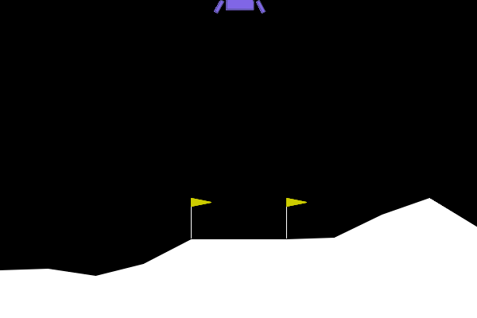
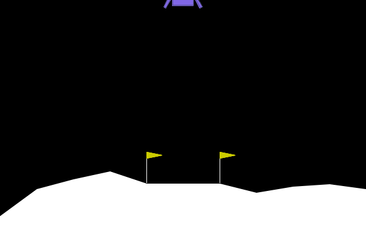
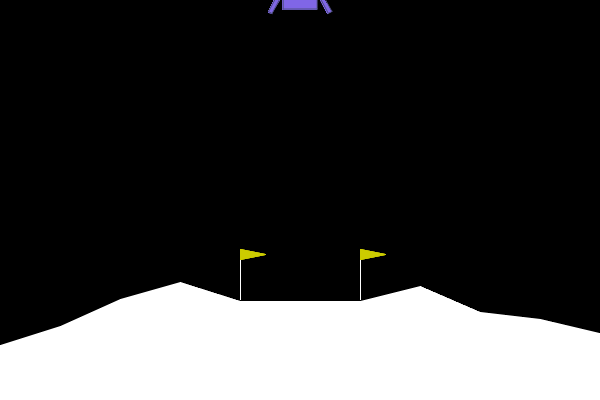
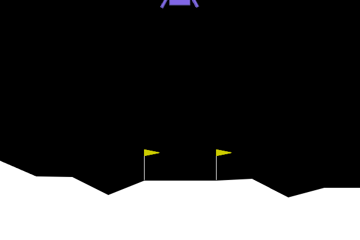
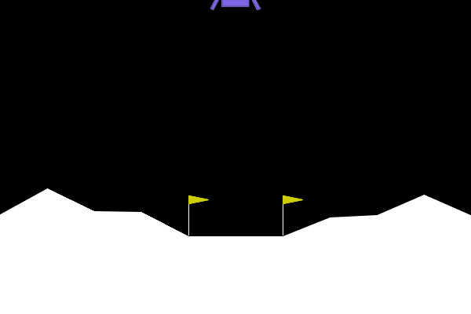
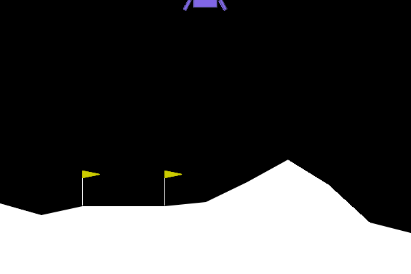
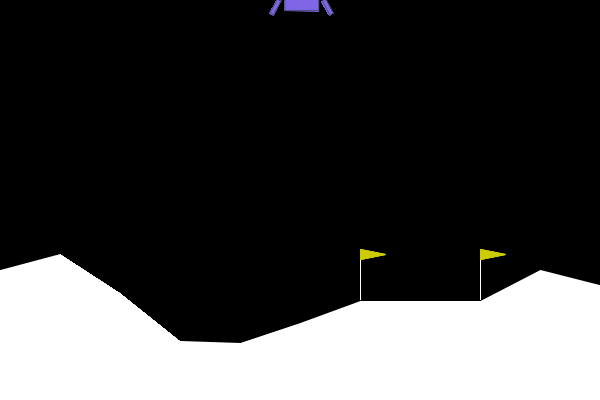
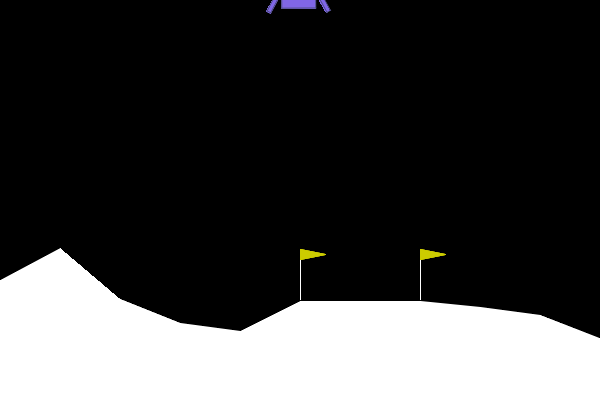
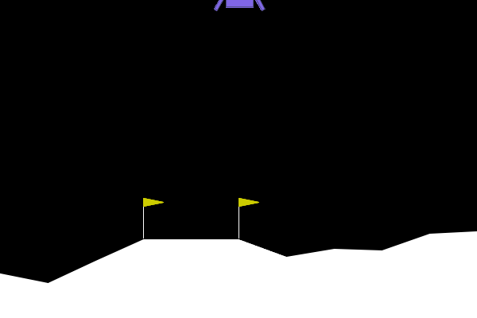
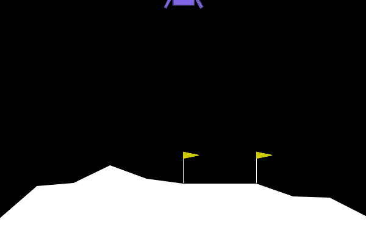

# Test bed 

Lunar lander with two goals, one on the left and one on the right.

<table>
  <tr>
    <td><br>Left Expert</td>
    <td><br>Left Expert</td>
    <td><br>Left Expert</td>
    <td><br>Left Expert</td>
  </tr>
  <tr>
    <td><br>Right Expert</td>
    <td><br>Right Expert</td>
    <td><br>Right Expert</td>
    <td><br>Right Expert</td>
  </tr>
</table>


Agent 1: A very dumb VLM trying to solve the task:

<table>
  <tr>
    <td><br>Right Student</td>
    <td><br>Right Student</td>
    <td><br>Left Student</td>
    <td><br>Left Student</td>
  </tr>
</table>

We can see that they sometimes can't even distinguish left and right:

```
{"type": "step", "episode": 0, "t": 0, "goal_x": 0.20000000298023224, "goal_side": "RIGHT", "action": [0.10000000149011612, -0.5], "reward": -0.551408953038947, "terminated": false, "truncated": false, "goal_dx": -0.2054570228792727, "goal_success": false, "vlm_called": true, "parsed_ok": true, "raw_vlm": "<think>Got it, let's look at the problem. The goal_x is 0.200, which is positive, so we need to go RIGHT. For lateral movement, moving right means using lateral <= -0.5 (left booster). Let's check the current position. The pad has two flags, and the goal_x is positive, so we need to move right. So lateral should be a negative value, maybe -0.5. The main engine might need to adjust, but since we're focusing on lateral first, let's set main maybe to 0.1 or so, but wait, the task is to land, so maybe start with main engine off or low. Wait, the action is [main, lateral]. Let's think: to move right, lateral should be <= -0.5, so let's use lateral = -0.5. Main engine maybe 0.1? Wait, but let's check the image. The lander is above, and the pad is under. To move right, use left booster (lateral <= -0.5). So action would be [main, lateral] = [0.1, -0.5] or similar. Wait, the problem says \"land on the pad near goal_x\". Since goal_x is positive, go right. So lateral should be negative (left booster). Let's set main to maybe 0.1 (thrust a bit) and lateral to -0.5. So the action is [0.1, -0.5]. Wait, but need to make sure. Alternatively, maybe main is 0, but no, need to control. Wait, the initial step, maybe start with main engine off (main=0) and lateral=-0.5. Wait, let's check the rules again. For lateral: lateral <= -0.5 is left booster (move right). So action is [main, lateral] = [0.0, -0.5] or [0.1, -0.5]. Let's pick main as 0.1, lateral as -0.5. So the JSON would be {\"action\":[0.1, -0.5]}."}
```
But they know that they need to go right, and they also use the right action scale: [0.10000000149011612, -0.5] means the left engine is working so the robot should go right. However there is a gap between the thoughts, action, and what really happens.


I have a simple automaton toy, which the expert will not have knowledge of where the goal is for the student and only infer the students intension through the action and thoughs and offer 60% of weight helping: we use vlm for every 5 steps, and the vlm will output an action and thoughs. Then the expert will guess the intension of the vlm and offer help.


<table>
  <tr>
    <td><br>Left Hybrid</td>
    <td><br>Left Hybrid</td>
    <td><br>Right Hybrid</td>
    <td><br>Right Hybrid</td>
  </tr>
</table>


## On Lunarlander with random landing location: what will the vlm perform?


<table>
  <tr>
    <td><br>Left Hybrid</td>
    <td><br>Left Hybrid</td>
    <td><br>Right Hybrid</td>
    <td><br>Right Hybrid</td>
    <td><br>Right Hybrid</td>
  </tr>
</table>

{"type": "step", "episode": 0, "t": 0, "helipad_x_world": 12.0, "goal_x_norm": 0.19999999999999996, "obs_x": 0.0058383941650390625, "goal_dx": -0.1941616058349609, "action": [0.5, -0.5], "reward": -1.3209916473705108, "terminated": false, "truncated": false, "landed": false, "goal_success": false, "vlm_called": true, "parsed_ok": true, "raw_vlm": "<think>Got it, let's analyze the problem. The goal is to land on the helipad, which is on the right side since goal_x_norm is 0.200 (wait, wait, wait. Wait, the problem says goal_x_norm < 0 => pad is LEFT, >0 => RIGHT. Here goal_x_norm is 0.200, which is >0, so pad is RIGHT. The current position: helipad_x_world is 12.000. The lander's position—wait, the image shows the lander is above, maybe starting with some position. But the key is to move towards the right pad. Since lateral negative moves right (+x), positive moves left (-x). The pad is on the right (goal_x_norm >0), so we need to adjust the x position. If the lander is to the left of the pad, we need to move right (lateral negative). But first, check the current position. Wait, the image shows two flags (helipad) on the white area. The lander is above, so maybe we need to first stabilize the vertical position (main engine) and then adjust lateral. But since the first step, maybe start with main engine to slow down vertical speed, and lateral to move towards the pad. Wait, the current state: need to land on the right pad (goal_x_norm >0), so lateral should be negative (move right) if the lander is left of the pad. But let's think about the action. The main engine is for vertical control. If the lander is moving down, we need to apply main thrust to slow down. But first, let's check the coordinates. The helipad is at 12.000, goal_x_norm is 0.200, which is normalized. Wait, maybe the lander's current x position is not aligned. So, action: maybe main engine to start decelerating, and lateral to move right. But let's make a reasonable first action. Let's say main engine is 0.5 (medium thrust to slow down), lateral is -0.5 (move right). Wait, but need to check the rules. The action is [main, lateral], each in [-1,1]. So main can be 0 to 1 for thrust, lateral -1 to 1. For landing, usually start with main engine to control vertical speed. So maybe main = 0.5, lateral = -0.5 (move right). Then reason would be \"Apply main thrust to slow descent, lateral thrust right towards pad\".</think><answer>{\"action\":[0.5,-0.5],\"reason\":\"Apply main thrust to slow descent, lateral thrust right towards pad\"}"}


## First

Trained a TD3 expert and collected 10000 episodes.

## Train Duffusion Of Distribution: learn an action denoiser p(a∣copilot_obs)

condition: copilot_obs = obs[:-1]


The copilot's observation x_t[:cond_dim] = x0[:cond_dim] which contains no noise, but the action has noise during training.

The final loss is about 0.18. I first trained a policy with a loss of 0.22 loss which turned out not enough. I also wonder if a single policy is enough for this? Should I try several expert policies?


## Then, we have the autonomy framework:


<table>
  <tr>
    <td><br>Left Hybrid</td>
    <td><br>Left Hybrid</td>
    <td><br>Right Hybrid</td>
    <td><br>Right Hybrid</td>
    <td><br>Right Hybrid</td>
  </tr>
</table>


{"type": "step", "episode": 0, "t": 0, "goal_x_norm": 0.19999999999999996, "pilot_action": [0.5, -0.5], "assist_action": [-0.9810952544212341, -0.6835295557975769], "exec_action": [-0.9810953140258789, -0.6835295557975769], "parsed_ok": true, "vlm_called": true, "k": 49, "reward": 1.4954983073837445, "terminated": false, "truncated": false, "goal_success": false}


# Put these together


<table>
  <tr>
    <td><br>Left Hybrid</td>
    <td><br>Left Hybrid</td>
    <td><br>Right Hybrid</td>
    <td><br>Right Hybrid</td>
    <td><br>Right Hybrid</td>
  </tr>
</table>

<table>
  <tr>
    <td><br>Left Hybrid</td>
    <td><br>Left Hybrid</td>
    <td><br>Right Hybrid</td>
    <td><br>Right Hybrid</td>
    <td><br>Right Hybrid</td>
  </tr>
</table>

## Prolblems

Diffusion steps during atonomy framework: using a k-step of 50 during training, and during denoising: tried 50, 25, and 15. 

50:

<table>
  <tr>
    <td><br>Left Hybrid</td>
    <td><br>Left Hybrid</td>
    <td><br>Right Hybrid</td>
    <td><br>Right Hybrid</td>
    <td><br>Right Hybrid</td>
  </tr>
</table>

25: 

<table>
  <tr>
    <td><br>Right Hybrid</td>
    <td><br>Left Hybrid</td>
    <td><br>Left Hybrid</td>
    <td><br>Right Hybrid</td>
    <td><br>Right Hybrid</td>
  </tr>
</table>

15:

<table>
  <tr>
    <td><br>Left Hybrid</td>
    <td><br>Left Hybrid</td>
    <td><br>Right Hybrid</td>
    <td><br>Right Hybrid</td>
    <td><br>Right Hybrid</td>
  </tr>
</table>


1. P(action| obs, Goal_ID)  This goal_id is ambiguous. But it can contain language information.
2. Vlm usage frequency, now I'm using the frequency of 5, I feel like the closer to the goal, the more frequent it should be using the inference. And I'm using a vlm of 10B, a very small one.
A combination of both super NoisyActor and LaggyActor in the original paper

3. Question on the real robot: create a task, like grab the box, is it like I will create a high level python script to solve this then collect 10000 epsoid then collect the data than train the diffusion?

Then 

The following plots show the success rate vs the forward diffusion ratio：
And also the min x to the goal and the final x to the goal.


Issues:

Problem with VLM actions.

The VLM is unreliable when producing low-level actions.
Its outputs are very coarse and repetitive, such as [0,0], [0.5, 0.5], or [0, 1].
This is expected, because the VLM does not understand continuous control.
Even for humans, directly specifying low-level actions is difficult.

Scaling the VLM does not help.
When I switch to a larger and “smarter” VLM, the performance becomes worse.
This suggests a VLM paradox: better semantic reasoning does not translate to better low-level control.

Baseline results.

VLM-only pilot: 0% success

Diffusion-only copilot (γ ≈ 1.0): ~20% success

VLM + diffusion (γ ≈ 0.5): ~26% success
The VLM helps reduce the minimum distance to the goal,
but fails at precise local manipulation due to its coarse actions.

Question.
The improvement from adding the VLM is marginal.
I need a setting where the VLM is essential, not optional.


New autonomy interface.
Instead of outputting actions, the VLM now outputs a relative target position at each step: (dx, dy).

This (dx, dy) is converted into a pseudo-action using a heuristic controller from the environment code.
The rest of the diffusion-based shared autonomy pipeline remains unchanged.


Unexpected result.
With this heuristic adapter, a zero-shot VLM alone already achieves 38% success.
Adding diffusion-based intervention sometimes hurts performance,
likely because the heuristic adapter is already very accurate.
